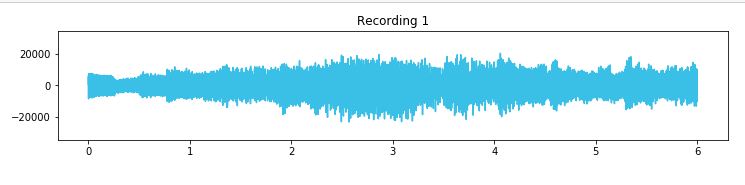

# Application on : Unsupervised Learning
## ICA-Music-separation-signal-project
### Independent Component Analysis Lab
In this notebook, we'll use Independent Component Analysis to retrieve original signals from three observations each of which contains a different mix of the original signals. This is the same problem explained in the ICA video.

### Dataset :
is in a wave form 

and here is sample visualization of input wave:

And here is a is sample visualization of output wave:

